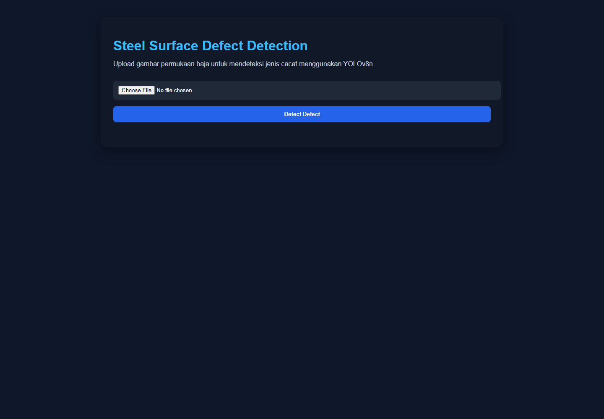
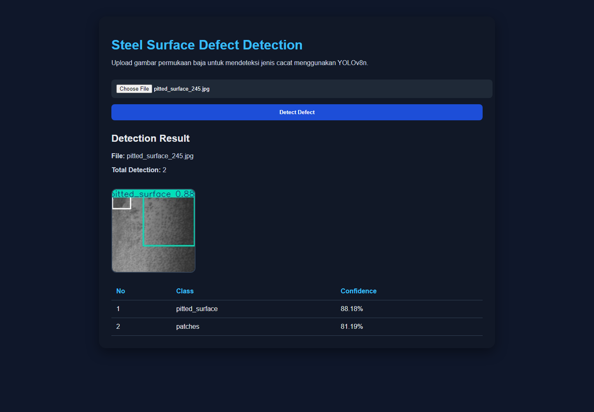
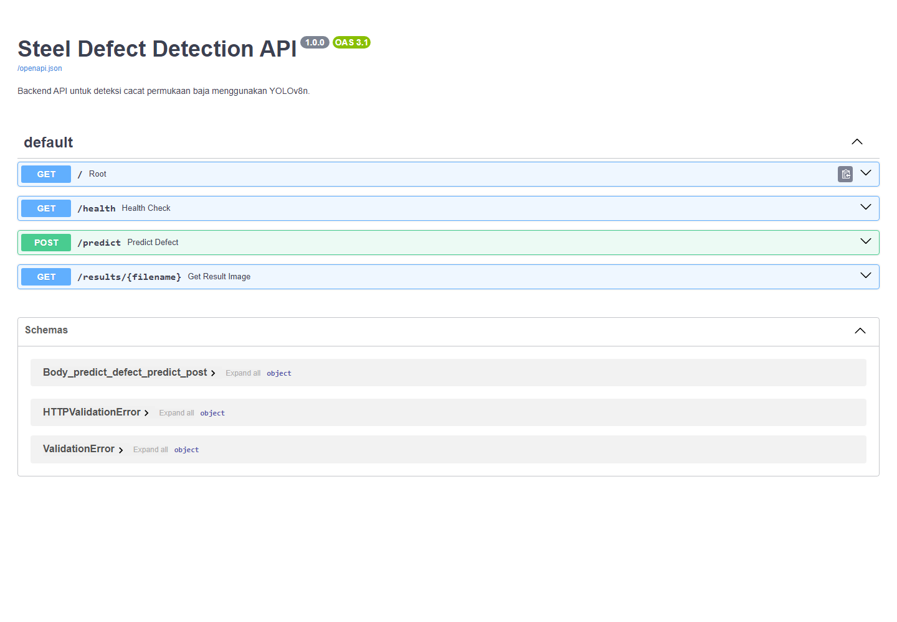
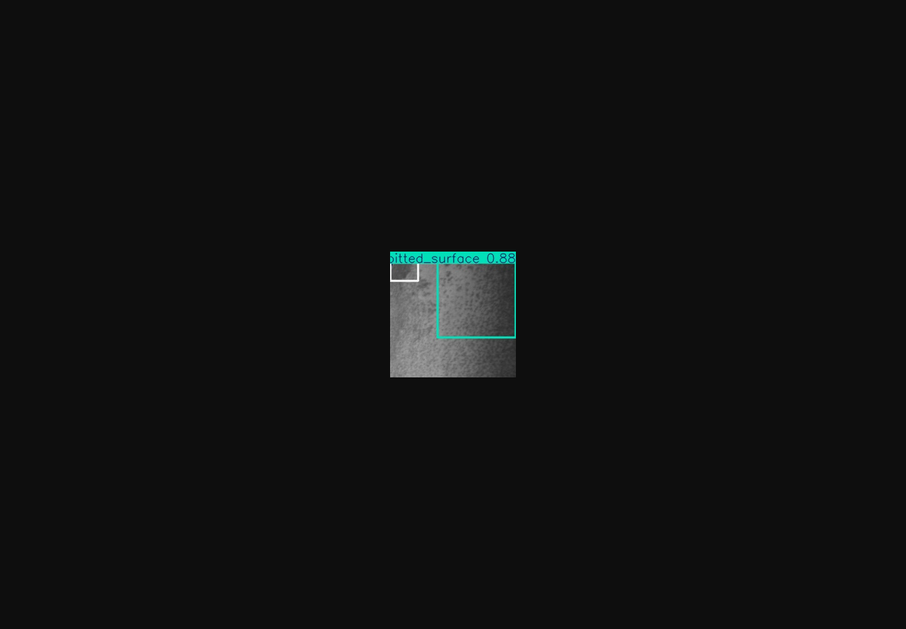

# Production Defect Detection QC

A computer vision MVP for detecting steel surface defects using **YOLOv8n**, **FastAPI**, and a lightweight **HTML/CSS/JavaScript** web upload interface.

This project was built as a quality-control prototype for manufacturing inspection. Users can upload steel surface images, and the system returns detection results with **bounding boxes**, **defect classes**, and **confidence scores**.

---

## Overview

Manual surface defect inspection in manufacturing can be time-consuming, inconsistent, and highly dependent on human visual accuracy.

This project implements an automated steel surface defect detection pipeline using the **YOLOv8n object detection model**. The model was trained on the **NEU-DET / NEU Surface Defect Database**, then integrated into a **FastAPI backend** and a simple web interface for image upload and prediction visualization.

The system is designed as an end-to-end MVP that demonstrates:

* dataset preparation
* annotation conversion to YOLO format
* model training
* model evaluation
* inference API development
* web-based prediction interface

---

## Defect Classes

The model detects six steel surface defect classes:

1. `crazing`
2. `inclusion`
3. `patches`
4. `pitted_surface`
5. `rolled-in_scale`
6. `scratches`

---

## Features

* Upload steel surface images
* Detect defects using YOLOv8n
* Display annotated images with bounding boxes
* Show predicted defect class labels
* Show confidence scores
* Return API response in JSON format
* Provide a simple web interface for demo usage

---

## Tech Stack

* Python
* YOLOv8n / Ultralytics
* FastAPI
* OpenCV
* HTML
* CSS
* JavaScript
* Git / GitHub

---

## Project Structure

```text
production-defect-detection-qc/
├── backend/
│   ├── app/
│   │   └── index.html
│   ├── results/
│   │   └── .gitkeep
│   ├── uploads/
│   │   └── .gitkeep
│   ├── weights/
│   │   └── best.pt
│   └── main.py
├── docs/
│   ├── images/
│   │   ├── web-upload-page.png
│   │   ├── prediction-result.png
│   │   ├── api-docs.png
│   │   └── sample-detection-output.png
│   └── model-card.md
├── training/
│   └── scripts/
│       ├── prepare_neu_det_yolo.py
│       └── train_yolo.py
├── requirements.txt
├── .gitignore
└── README.md
```

---

## Demo Preview

### Web Upload Interface



### Prediction Result



### FastAPI Documentation



### Sample Detection Output



---

## Model

The model used in this project is **YOLOv8n**, the lightweight version of YOLOv8.

YOLOv8n was selected because it is fast, efficient, and suitable for building a baseline object detection prototype. The model predicts both the defect location and the defect class from steel surface images.

The trained model used for inference is stored at:

```text
backend/weights/best.pt
```

---

## Model Performance

Baseline evaluation results:

| Metric    | Score |
| --------- | ----: |
| Precision | 0.696 |
| Recall    | 0.713 |
| mAP50     | 0.761 |
| mAP50-95  | 0.420 |

The model is suitable for an MVP/demo baseline. However, it is not yet production-ready because several classes still require further improvement, especially `crazing` and `rolled-in_scale`.

---

## Per-Class Performance

| Class           | mAP50 | mAP50-95 |
| --------------- | ----: | -------: |
| crazing         | 0.467 |    0.219 |
| inclusion       | 0.874 |    0.516 |
| patches         | 0.932 |    0.604 |
| pitted_surface  | 0.842 |    0.466 |
| rolled-in_scale | 0.560 |    0.232 |
| scratches       | 0.891 |    0.485 |

The strongest classes in the baseline model are `patches`, `scratches`, and `inclusion`. The weaker classes are `crazing` and `rolled-in_scale`, which should be prioritized in future model improvement.

---

## How to Run

### 1. Clone Repository

```bash
git clone https://github.com/tottifawwazr/production-defect-detection-qc.git
cd production-defect-detection-qc
```

---

### 2. Create Virtual Environment

```bash
python -m venv .venv
```

---

### 3. Activate Virtual Environment

Windows PowerShell:

```bash
.venv\Scripts\Activate.ps1
```

Command Prompt:

```bash
.venv\Scripts\activate
```

Linux / macOS:

```bash
source .venv/bin/activate
```

---

### 4. Install Dependencies

```bash
pip install -r requirements.txt
```

---

### 5. Run Backend

```bash
uvicorn backend.main:app --reload
```

If the server runs successfully, it will be available at:

```text
http://127.0.0.1:8000
```

---

### 6. Open Web App

Open this URL in your browser:

```text
http://127.0.0.1:8000/app
```

---

### 7. Open API Documentation

FastAPI automatically provides API documentation at:

```text
http://127.0.0.1:8000/docs
```

Main prediction endpoint:

```text
POST /predict
```

This endpoint is used to upload an image and receive detection results.

---

## API Response Example

Example response from the `/predict` endpoint:

```json
{
  "filename": "pitted_surface_245.jpg",
  "total_detections": 2,
  "detections": [
    {
      "class_id": 3,
      "class_name": "pitted_surface",
      "confidence": 0.8818,
      "bbox": {
        "x1": 44.52,
        "y1": 12.84,
        "x2": 187.61,
        "y2": 154.23
      }
    },
    {
      "class_id": 2,
      "class_name": "patches",
      "confidence": 0.8119,
      "bbox": {
        "x1": 0.0,
        "y1": 23.15,
        "x2": 45.63,
        "y2": 65.77
      }
    }
  ],
  "result_image_url": "/results/example_result.jpg"
}
```

---

## Web App Workflow

1. Open the web application
2. Select a steel surface image
3. Click **Detect Defect**
4. View the annotated detection image
5. Review predicted classes and confidence scores in the result table

---

## Dataset

The training dataset used in this project is the **NEU Surface Defect Database / NEU-DET**.

The raw dataset is not included in this repository to keep the repository lightweight. Dataset files, training outputs, local uploads, and prediction outputs are excluded using `.gitignore`.

---

## Training Pipeline

The training workflow:

```text
Raw NEU-DET Dataset
        ↓
Convert XML annotations to YOLO format
        ↓
Split dataset into train, validation, and test sets
        ↓
Train YOLOv8n model
        ↓
Evaluate model performance
        ↓
Save best model weights
        ↓
Integrate model into FastAPI backend
```

Training scripts are available in:

```text
training/scripts/
```

---

## Model Card

A model card is provided to document the model, dataset, metrics, limitations, and future improvement plan:

```text
docs/model-card.md
```

---

## Notes

This repository focuses on the MVP/demo implementation. Some large or temporary files are intentionally excluded, such as:

* raw dataset files
* training output folder `runs/`
* virtual environment `.venv/`
* user-uploaded images
* temporary prediction results

The main inference model is located at:

```text
backend/weights/best.pt
```

---

## Limitations

Current limitations:

* The model is still a baseline model
* Some classes have relatively low performance
* The model has not been trained on real manufacturing data
* No database logging is implemented yet
* No user authentication is implemented
* No cloud deployment is available yet
* No production monitoring pipeline is implemented yet

---

## Future Improvements

Potential improvements:

* Train for more epochs
* Use a stronger YOLO variant such as YOLOv8s or YOLOv8m
* Add more data augmentation
* Add database logging for prediction history
* Add a monitoring dashboard
* Build a React or Next.js frontend
* Add Docker support
* Deploy the API and frontend to a cloud server
* Evaluate the model on real production data

---

## Author

**Totti Fawwaz Reda**

Project: Production Defect Detection QC

---

## Status

Project status: **MVP / Demo Baseline Completed**

Completed components:

* YOLOv8n model training
* Model evaluation
* Test image inference
* FastAPI backend
* `/predict` endpoint
* Web image upload interface
* Annotated result image display
